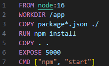
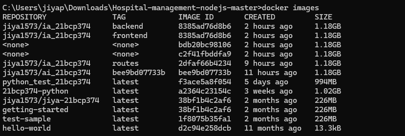
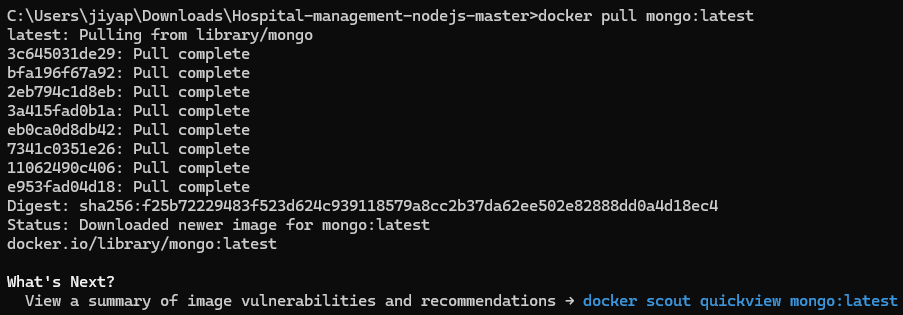
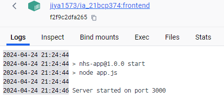
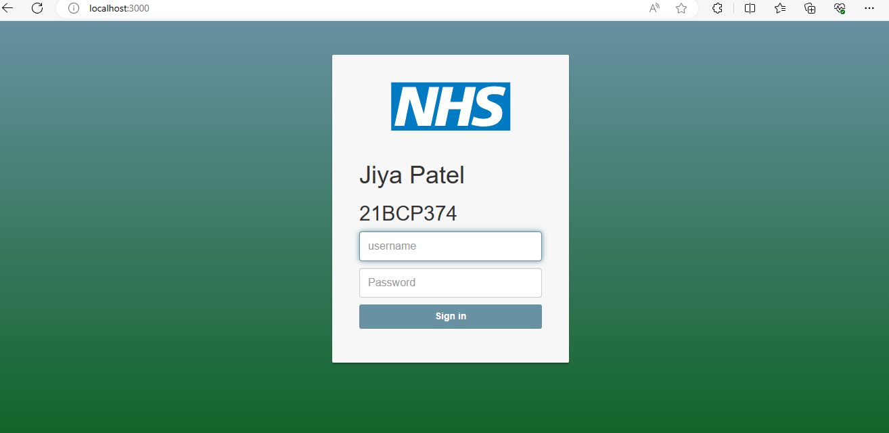
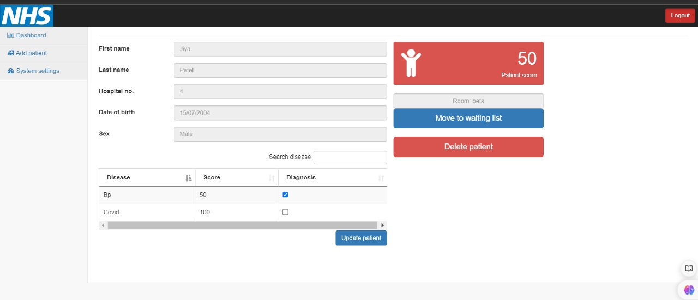
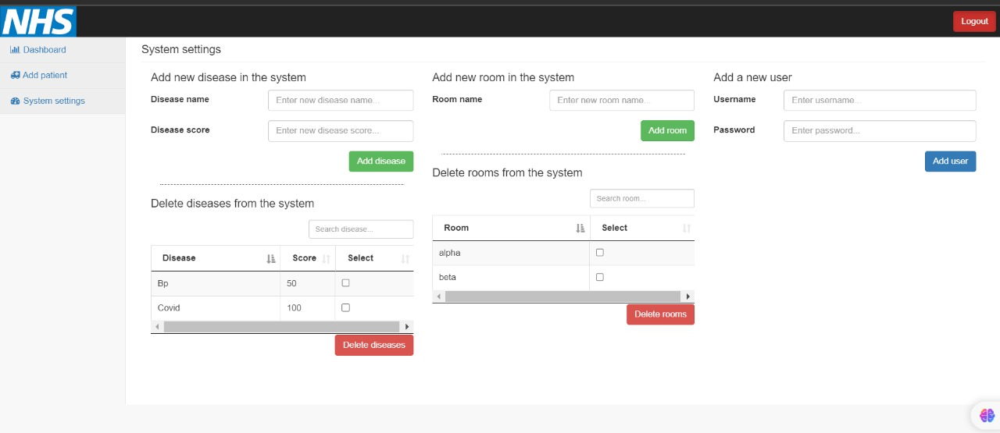
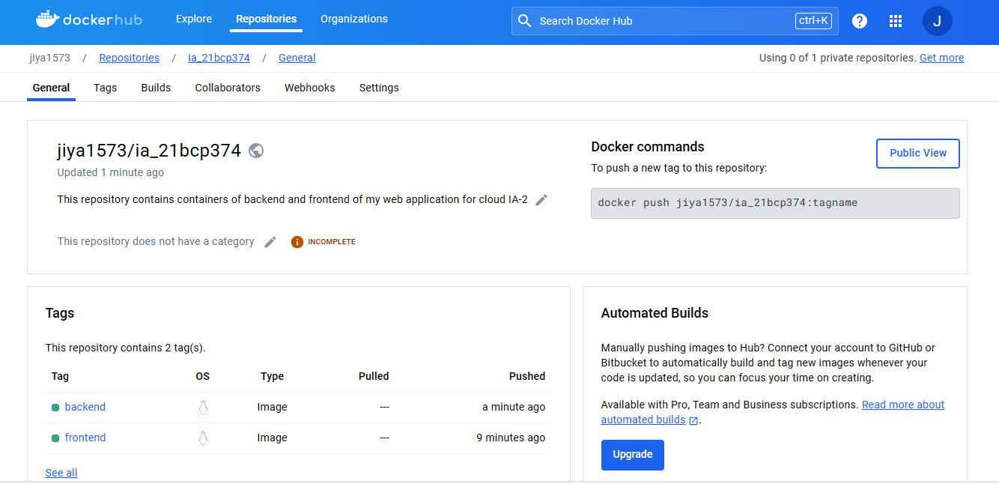

# Jiya1573_IA
Jiya Patel-21BCP374-Docker three-tier application
Docker 3 tier application

# Three-tier application tutorial
#### This is a tutorial for creating three-tier application using Docker  
##### Step 1: Choose a project from GitHub  
Here is the github link we have taken for this tutorial.    
[Hospital-management-nodejs](https://github.com/andreimargeloiu/Hospital-management-nodejs)

##### Step 2: After cloning, we have to create two separate Dockerfile for each client & server.
We wil use docker compose to create a multi-container setup.

##### Step 3:Add the below code in Dockerfile  
   

##### Step 4: Create a new repository in the docker hub  
  

##### Step 5: For each tier of your application, you'll need to create a Docker image using a Dockerfile and push it in github repository.  
Open terminal in the root directory of your folder and run these docker commands:  
a. Create docker image (front-end):

b. Create docker image (back-end):

c. Check the created images using docker images command:

##### Step 6: Now pull the created images
  

##### Step 7: Now we will run the images created and create a database network and connect to it.
  
  
Check the created images using docker ps command

Connect to the database
  

##### Step 8: Now we use Docker Compose to run stack of containers.
docker-compose up -d  
The Docker Desktop will give following logs of images created 

  

 

##### Step 9: Test on localhost.
  
  
  

Verify on MongoDB Compass
 

##### Step 10: Push Images to DockerHub
a. Push frontend docker image to github repository
  

b. Push backend docker image to github repository
  

The images are now pushed in docker hub repository

